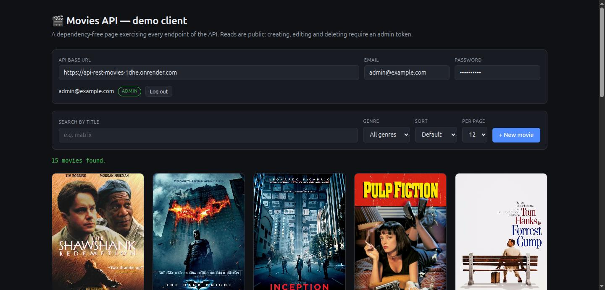
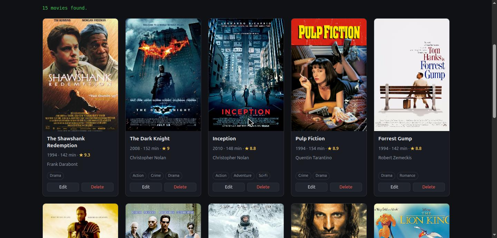
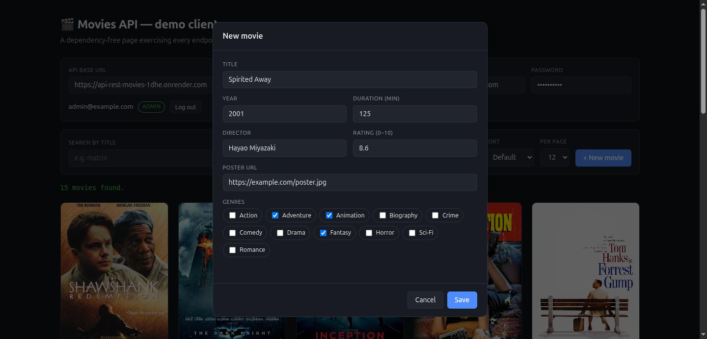
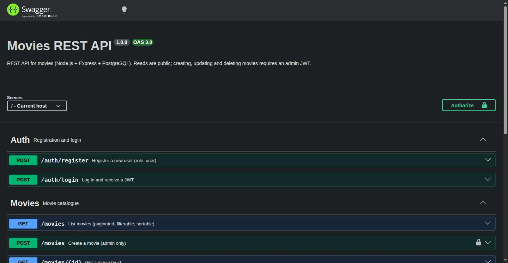

# Movies REST API

A REST API for a movie catalogue with JWT authentication, built to practise a clean MVC architecture in Node.js.

## Problem

Most tutorial APIs collapse the moment you swap the data source or add authentication: the SQL leaks into the controllers and nothing is testable without a live database. This project keeps the data models behind a single injected interface, so the same Express app runs against PostgreSQL in production and against an in-memory store in tests. A shared contract suite runs over both backends, which is what caught two bugs that only appeared on the database side.

## Tech Stack

`Node.js 18+` `Express 5` `PostgreSQL 16` `Zod` `JWT` `bcrypt` `Vitest` `Supertest` `Docker` `GitHub Actions`

## Features

- REST CRUD for movies with an MVC structure (routes → controllers → models).
- JWT authentication: register and login, bcrypt-hashed passwords, `user` / `admin` roles.
- Reads are public; creating, updating and deleting a movie requires an admin token.
- Request validation with Zod on every endpoint, including query strings.
- Title search, genre filtering, sorting and pagination on `GET /movies`, all combinable.
- A dependency-free demo client that exercises every endpoint, with role-aware UI.
- Consistent error responses (`{ status, code, message, details? }`) from a central error handler.
- Interactive OpenAPI 3.0 docs served at `/docs`.
- Two interchangeable data backends (PostgreSQL and in-memory) verified by one shared contract test suite.
- `helmet`, a CORS whitelist and per-IP rate limiting.
- Docker Compose stack and a CI pipeline that runs lint plus tests against a real PostgreSQL service.

## Screenshots

All four are from the live deployment.

**Demo client** — search, genre filter, sorting and pagination.



**Admin actions** — Edit and Delete only render for a token whose role is `admin`.



**Create / edit form** — genre checkboxes come from the same whitelist the API validates against; server-side Zod errors are shown per field.



**Swagger UI at `/docs`** — every endpoint is documented and callable from the browser.



## Installation

### Option A — Docker (recommended)

Starts PostgreSQL (auto-seeded from `schema.sql`) and the API together:

```bash
git clone https://github.com/Hector-0-0/Api-rest-movies.git
cd Api-rest-movies
docker compose up --build
```

- API: http://localhost:3000
- Docs: http://localhost:3000/docs

### Option B — Local Node + your own PostgreSQL

Requires Node.js ≥ 18 and a running PostgreSQL 13+.

```bash
git clone https://github.com/Hector-0-0/Api-rest-movies.git
cd Api-rest-movies
npm install

cp .env.example .env          # edit the DB_* values to match your PostgreSQL

createdb moviesdb
psql -d moviesdb -f schema.sql

npm run dev                   # or `npm start`
```

A seed admin is created so the protected routes can be exercised right away:

| Email | Password | Role |
| --- | --- | --- |
| `admin@example.com` | `admin12345` | admin |

### Environment variables

| Variable | Description | Default |
| --- | --- | --- |
| `NODE_ENV` | `development`, `production` or `test` | `development` |
| `PORT` | Port the server listens on | `3000` |
| `CORS_ORIGINS` | Comma-separated allowed origins (any `*.vercel.app` is allowed too) | _(empty)_ |
| `DATABASE_URL` | Full connection string. Wins over the `DB_*` variables below | _(unset)_ |
| `DB_HOST` / `DB_USER` / `DB_PASSWORD` / `DB_NAME` / `DB_PORT` | Discrete connection settings | `localhost` / `postgres` / `postgres` / `moviesdb` / `5432` |
| `DB_SSL` | `true` for managed providers requiring TLS. Implied by `sslmode=require` | `false` |
| `JWT_SECRET` | Secret used to sign JWTs (**set a strong value in production**) | dev fallback |
| `JWT_EXPIRES_IN` | Token lifetime (e.g. `1h`, `7d`) | `1d` |
| `BCRYPT_ROUNDS` | bcrypt cost factor | `10` |

## Usage

### Endpoints

| Method | Endpoint | Auth | Description |
| --- | --- | --- | --- |
| `POST` | `/auth/register` | — | Register a user (role `user`), returns a JWT |
| `POST` | `/auth/login` | — | Log in, returns a JWT |
| `GET` | `/movies` | — | List movies (`?q`, `?page`, `?limit`, `?genre`, `?sort`) |
| `GET` | `/movies/:id` | — | Get a movie by id |
| `POST` | `/movies` | admin | Create a movie |
| `PATCH` | `/movies/:id` | admin | Partially update a movie |
| `DELETE` | `/movies/:id` | admin | Delete a movie |
| `GET` | `/health` | — | Health check |
| `GET` | `/docs` | — | Swagger UI |

`GET /movies` returns a plain array; pagination metadata travels in the `X-Total-Count`, `X-Total-Pages`, `X-Page` and `X-Limit` response headers.

The query parameters combine, so `?q=the&genre=Sci-Fi&sort=-rate` returns Sci-Fi titles containing "the", highest rated first. `q` is a case-insensitive partial match on the title, and `%` / `_` are matched literally rather than as wildcards.

### Example: log in and create a movie

```bash
# 1. Log in and capture the token
TOKEN=$(curl -s -X POST http://localhost:3000/auth/login \
  -H "Content-Type: application/json" \
  -d '{"email":"admin@example.com","password":"admin12345"}' | jq -r .token)

# 2. Create a movie (admin only)
curl -X POST http://localhost:3000/movies \
  -H "Content-Type: application/json" \
  -H "Authorization: Bearer $TOKEN" \
  -d '{
    "title": "Spirited Away",
    "year": 2001,
    "director": "Hayao Miyazaki",
    "duration": 125,
    "poster": "https://example.com/poster.jpg",
    "rate": 8.6,
    "genre": ["Animation", "Adventure", "Fantasy"]
  }'
```

See [`api.http`](./api.http) for a ready-to-run request collection (VS Code REST Client).

### Demo client

The API serves a dependency-free demo page (`web/index.html`) at its root, so
running the server is enough — open http://localhost:3000 and it is there. The
*API base URL* field lets you point it at a different backend.

### Tests

```bash
npm test          # in-memory backend only, no database needed
npm run test:db   # starts PostgreSQL via Docker and runs the full suite
npm run coverage
npm run lint
```

`tests/models.contract.test.mjs` runs the same contract over both data backends. The PostgreSQL half is skipped unless `TEST_DATABASE_URL` is set, so the default `npm test` stays database-free while CI runs everything.

## Demo

Live at **https://api-rest-movies-1dhe.onrender.com**

| | |
| --- | --- |
| Demo client | https://api-rest-movies-1dhe.onrender.com |
| Interactive docs | https://api-rest-movies-1dhe.onrender.com/docs |
| Health check | https://api-rest-movies-1dhe.onrender.com/health |

Sign in with the seed admin (`admin@example.com` / `admin12345`) to enable
creating, editing and deleting.

> **First request may take up to a minute.** The API runs on Render's free
> tier, which spins the service down after 15 minutes without traffic and
> takes about a minute to wake it back up. Later requests are fast. The
> database is on Neon, which also scales to zero but resumes in about a
> second.

Backend on [Render](https://render.com), PostgreSQL on [Neon](https://neon.tech).

## Project structure

```
src/
├── app.mjs              # Express app definition (no listen)
├── server.mjs           # Entry point: wires the PostgreSQL models
├── config/              # Env-based configuration
├── routes/              # Route definitions
├── controllers/         # HTTP layer
├── models/
│   ├── database/        # PostgreSQL-backed models
│   └── local-file-system/  # In-memory models
├── middlewares/         # validate, auth, cors, rate-limit, error-handler
├── schemas/             # Zod schemas
├── auth/                # JWT helpers
└── docs/                # OpenAPI spec
schema.sql               # PostgreSQL schema + seed data
tests/                   # Vitest + Supertest suites
web/                     # Static demo client
```

## Author

Héctor David Flores Sánchez — [LinkedIn](https://www.linkedin.com/in/héctor-david-flores-sánchez-76b636354/) · [Portfolio](https://hector-0-0.github.io/) · [Email](mailto:hector.d.flores.s@gmail.com)
